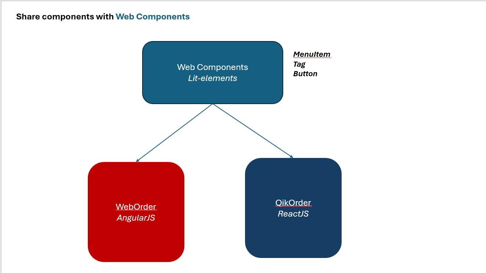

# QikServe's Multi Project Structure challenge

The main goal of this challenge consists to propose a solution to improve the codebase of two products that has different purposes but some of the elements in UI are the same (e.g. menu items).

## Solution

To solve this challenge my proposal is to implement a library of components using the [`lit-element`](https://lit.dev/), this library create a pure components using HTML and CSS, based on this we can reuse the components in different architectures like as AngularJS, ReactJS and others.

## Arctecture

Basicly one project that contains components/elements to provide to anopther project.